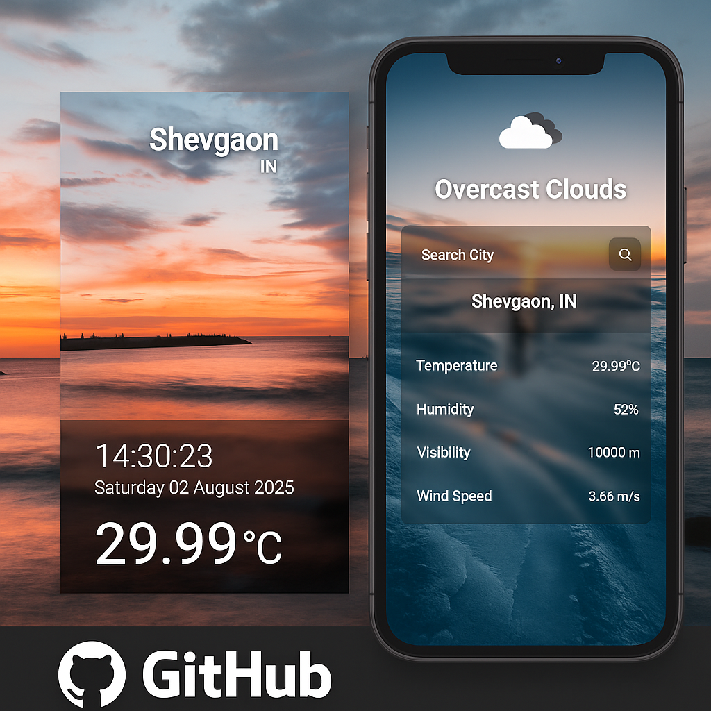
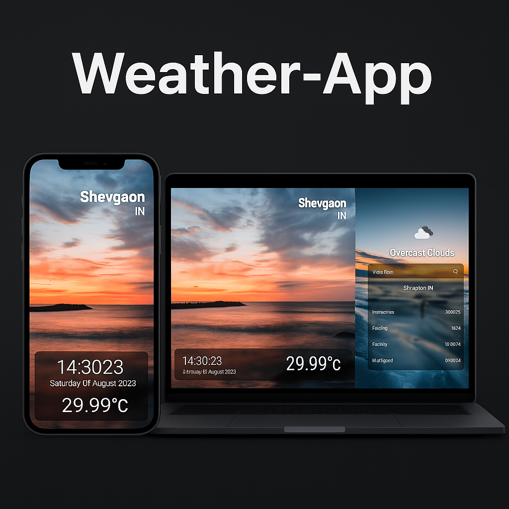

# 🌤️ React Weather App

A responsive and modern weather application built with **React**, **Vite**, and **Material UI**, powered by the **OpenWeatherMap API**. This app displays real-time weather data with dynamic backgrounds, live date & time, and a clean two-column glassmorphism UI.

---

## 🚀 Features

- 🌍 Search weather by city name
- 📅 Real-time date and time
- 🌦️ Dynamic background images based on weather
- 💧 Displays temperature, humidity, visibility, wind speed
- 📱 Fully responsive layout (desktop and mobile)
- 💅 Built with Material UI and styled using CSS and normalize.css

---

## 🛠️ Tech Stack

| Tool            | Purpose                          |
|-----------------|----------------------------------|
| React           | Core UI library                  |
| Vite            | Lightning-fast dev/build tool    |
| Material UI     | UI components and icons          |
| Emotion         | MUI's styling engine             |
| title-case      | Format weather descriptions      |
| normalize.css   | Cross-browser CSS normalization  |

---

## 🔐 API

- Data is fetched from [OpenWeatherMap](https://openweathermap.org/current)
- You must provide an **API key** via environment variable:

```
VITE_W_API_KEY=your_api_key_here
```

---

## 📦 Getting Started

### 1. Clone the repository

```bash
git clone https://github.com/CyberHunter8857/Weather-App.git
cd weather-app
```

### 2. Install dependencies

```bash
npm install
```

### 3. Add your API key

Create a `.env` file in the root:

```bash
VITE_W_API_KEY=your_openweathermap_api_key
```

### 4. Run the development server

```bash
npm run dev
```

### 5. Build for production

```bash
npm run build
```

---

## 📁 Folder Structure

```
src/
├── components/
│   ├── LeftPanel.jsx
│   ├── RightPanel.jsx
│   ├── SearchBox.jsx
│   └── WeatherInfo.jsx
├── weatherBackgrounds.js
├── WeatherPage.jsx
├── WeatherPage.css
```

---

## 🖼️ Preview




---

## 🔗 Useful Links

- 🔗 GitHub Repo: [https://github.com/CyberHunter8857/Weather-App](https://github.com/CyberHunter8857/Weather-App)
- 🌐 Live Site: [https://weather-app-ten-xi-67.vercel.app/](https://weather-app-ten-xi-67.vercel.app/)

---

## 📄 License

This project is open-source and free to use.

---

## 🙌 Acknowledgments

- [OpenWeatherMap](https://openweathermap.org/)
- [Material UI](https://mui.com/)
- [Vite](https://vitejs.dev/)
